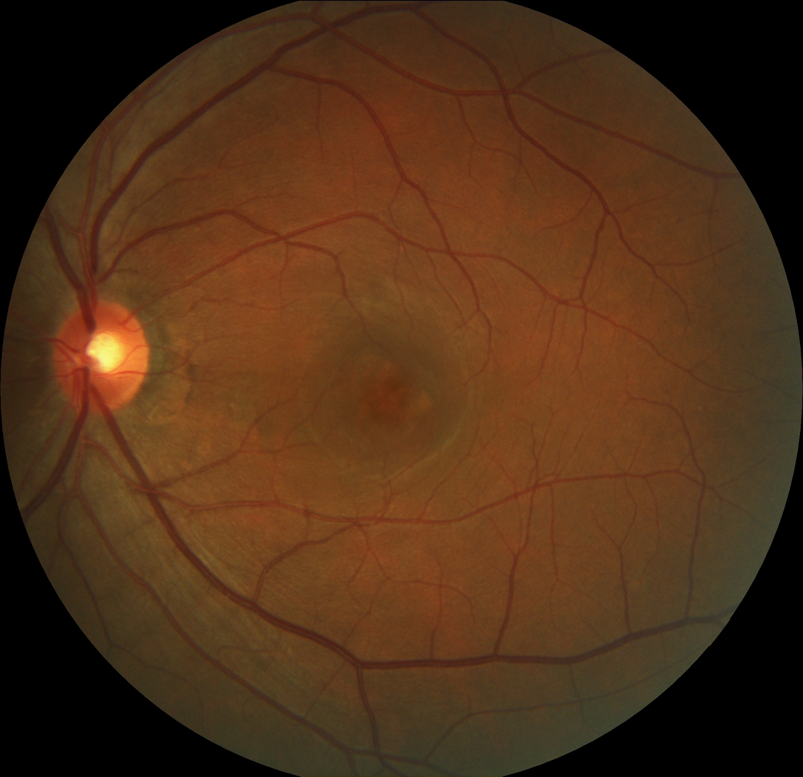
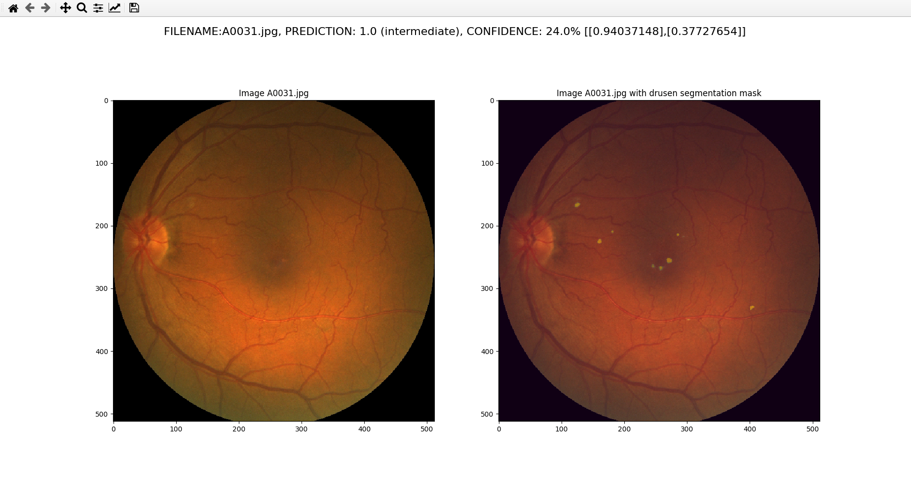

<!-- ABOUT THE PROJECT -->
## About The Project

  

Automated pipeline to detect drusens (AMD clinical sign) from fundus retinal images and classify them according to the accepted simplified clinical scale:

| AMD progression  | Drusen description |
| ------------- | ------------- |
| Normal ageing changes  | Only small drusen < 63μm  |
| Early AMD  | Medium drusen > 63 µm  |
| Intermediate AMD  | Large drusen >125 µm  |
| Late AMD  | Atrophic or neovascular  |


Two different but complementary approaches are proposed: classification and segmentation. Both have been trained and tested on Alienor (http://www.alienor-study.com/), a proprietary dataset of 1200 images (2240x1488). The trained classification model yielded better results on this particular dataset than other similar project such as DeepSeeNet: https://github.com/ncbi-nlp/DeepSeeNet   

### Classification. 
This is the main part of this project. Two CNNs models: EfficientNet(b2) and Resnet18 were trained and then combined into a single Ensemble model that was further optimized. Others projects were used, in particular for augmentation purposes: https://github.com/automl/trivialaugment, https://github.com/albumentations-team/albumentations, https://github.com/adgaudio/ietk-ret


### Segmentation. 
It is a re-implementation of this repository: https://github.com/QuangBK/drusen_seg, but using state of the art transformer segmentation model Segformer from https://github.com/NVlabs/SegFormer. As there is no open source drusen segmentation dataset that could be used for training (ADAM segmentation dataset uses coarse labeling), the groundtruths used to train Segformer were the segmentations maps from QuangBK's work. Therefore it can be considered as a basic type of knowledge distillation from their model.

<!-- GETTING STARTED -->
## Getting Started

### Training the models
train.py allows to train the proposed models: [CNN architectures visualization](./images/archigit.pdf)
To display all the available parameters:
```sh
python3 train.py --help
```
example run:
```sh
python3 train.py -p data_path/ -m pretrained_weights/
```

### Make predictions on a test
predictions.py allows to evaluate a given pretrained model on a test set. It makes predictions and calculates accuracy, precision, recall, kappa, f1 score and saves the confusion matrix and the AUC plot.

### Make inferences on new data
Given a path to a directory containing fundus images, inference.py automatically outputs in a matplotlib window:
1. A drusen prediction (either 'small/none', 'intermediate' or 'large')
2. A confidence score ranging from 0 to 100 for this prediction
3. A segmentation mask as an overlay to visualize the location and the size of the drusen

and saves all the outputs in a csv file.

example run:
```sh
python3 inference.py -p data_path/ 
```
example output:



